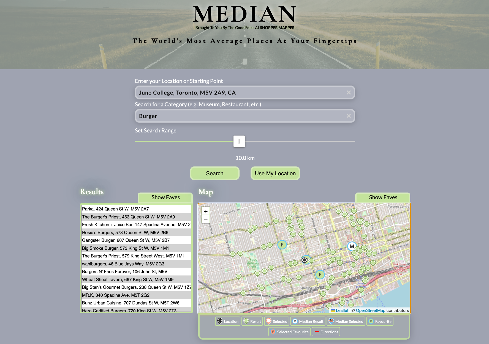

# Median (built by team at Shopper Mapper)

Tired of being bombarded with recommendations for the latest, trendiest hotspots? We understand that sometimes all you crave is a familiar haunt, a cozy nook that feels like home. That's why we're on a mission to simplify the decision-making process and help you discover those reliable, down-to-earth gems that never fail to hit the spot. Whether it's a restaurant, bar, grocery store, or coffee shop, we've got you covered with the inside scoop on the places that will feel like a warm embrace. Let us help you uncover the hidden treasures that will quickly become your go-to spots.

[Live Site](https://median-mapper.netlify.app/)

> Project developed by Shopper Mapper team, arranged by Juno College

## Table of contents

- [Overview](#overview)
  - [The Goal](#the-goal)
  - [Deliverables](#deliverables)
  - [Screenshots](#screenshots)
  - [Built With](#built-with)
- [Contributors](#contributors)
- [License](#license)

## Overview

### The Goal

Our goal was to craft a complete end-to-end solution that fulfilled the client's vision, all while working as part of a team. Throughout the project, we honed our expertise in React's fundamental concepts, organized seamless collaboration among developers, and executed to deliver a fully functional product that exceeded expectations.

### Deliverables

- Use the MapQuest API.
- A user should be able to use their current location or input a location as a base starting point.
- The user should be able to type in a query (e.g. clothing, museums, coffee shop, bar, etc.).
- Users can see every instance of that query within 10km of the base location ordered by relevance.
  The middle location of the returned list should be highlighted. (If it’s an even number, the middle two.).
- The user should be able to choose a returned destination and get directions from the base location to that destination.
- Proper error handling. For example:
  - If a user types in a query that yields no result - they should be provided feedback (e.g. there were no results found).
- Common error responses should be handled.
- API loading states.

### Screenshots

### Built With

- React.js
- MapQuest SDKs
- Leaflet
- Firebase
- git/Github
- VS Code live-share extension
- Trello

### Contributors

<table>
  <tbody>
    <tr>
      <td align="center">
        <a href="https://github.com/graydonj"
          > <b>Graydon James</b></a
        > <a
          href="https://graydongames.com"
          title="graydongames.com"
          >🖥️</a
        >
        <a
          href="mailto:graydonj2@gmail.com"
          title="email Graydon"
          >✉️</a
        >
      </td>
      <td align="center">
        <a href="https://github.com/Maktastix"
          > <b>Michael Makinde</b></a
        > <a
          href="https://michaelmakinde.com"
          title="michaelmakinde.com"
          >🖥️</a
        >
        <a
          href="mailto:michael_makinde@outlook.com"
          title="email Michael"
          >✉️</a
        >
      </td>
      <td align="center">
        <a href="https://github.com/johnmal-dev"
          > <b>John Malapit</b></a
        > <a
          href="https://www.johnmal.dev"
          title="johnmal.dev"
          >🖥️</a
        >
        <a
          href="mailto:johncmalapit@gmail.com"
          title="email John"
          >✉️</a
        >
      </td>
    </tr>
  </tbody>
</table>

### License

MIT License
Copyright (c) 2023 Graydon James, Michael Makinde & John Malapit
